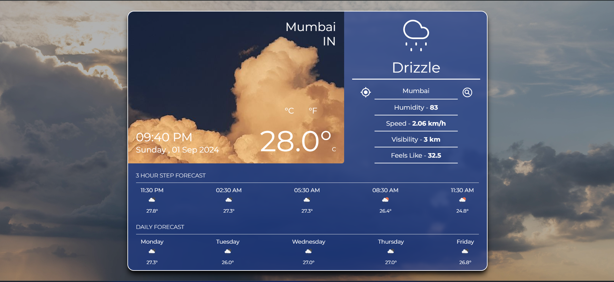

# 🌤️ Weather App

A React-based Weather App that displays current weather data for your location and any specified location. It also provides a forecast for future weather conditions. 

## 🚀 Features

- **Current Location Weather**: Automatically fetches and displays the weather data for your current location.
- **Search Weather by Location**: Allows users to search for weather data in any city or location worldwide.
- **Future Forecasts**: Provides a detailed weather forecast for upcoming days.

## 📦 Installation

To get a local copy up and running, follow these steps:

1. **Clone the repository**:

    ```bash
    git clone https://github.com/ItsMeRanajit/CloudCast.git
    cd weather-app
    ```

2. **Install dependencies**:

    ```bash
    npm install
    ```

3. **Create an `.env` file**:

    Create a `.env` file in the root directory and add your OpenWeatherMap API key:

    ```env
    VITE_WEATHER_API_KEY=your_api_key_here
    ```

4. **Start the development server**:

    ```bash
    npm start
    ```

    The app will run on `http://localhost:5173`.

## 🌐 Usage

1. Open the app in your browser.
2. Allow location access to fetch current weather data.
3. Use the search bar to look up weather data for different cities.
4. View the weather forecast for the next few days.

## 📸 Screenshots

Here's a look at the Weather App:


*Screenshot showing the home page with current weather data.*


## 🤝 Contributing

Contributions are welcome! Please follow these steps to contribute:

1. Fork the Project
2. Create your Feature Branch (`git checkout -b feature/AmazingFeature`)
3. Commit your Changes (`git commit -m 'Add some AmazingFeature'`)
4. Push to the Branch (`git push origin feature/AmazingFeature`)
5. Open a Pull Request

## 📝 License

This project is licensed under the MIT License - see the [LICENSE](LICENSE) file for details.

*Thanks for checking out the Weather App! If you like this project, please give it a ⭐ on GitHub!*
